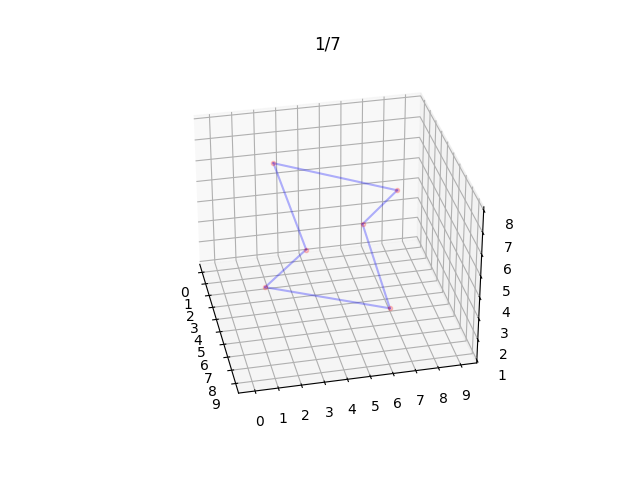

# Frawks
This is a python program to generate 3D fractograms, based on [the article for 2D fractograms by Hugh Duncan published in Chalkdust Magazine, Issue no. 2](https://chalkdustmagazine.com/features/fractograms/). Requires numpy, matplotlib and mpmath. The animation version requires FFmpeg.

