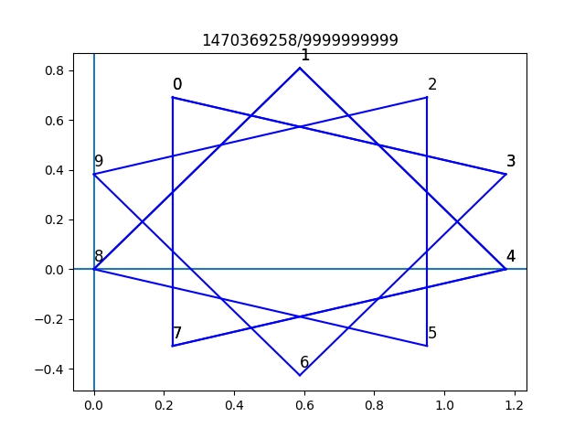

# Frawks
This is a python program to generate Frawks, based on [the article by Hugh Duncan in Chalkdust Magazine](https://chalkdustmagazine.com/blog/frawks/). Requires numpy, matplotlib and mpmath.

